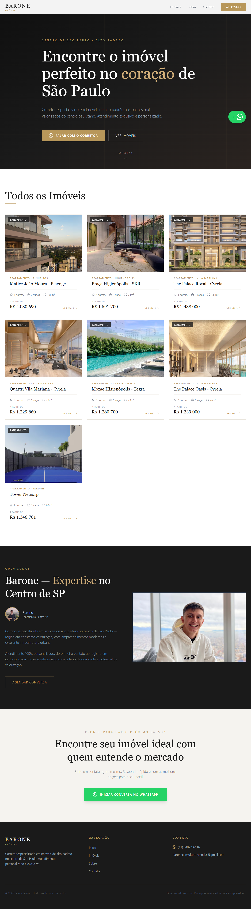
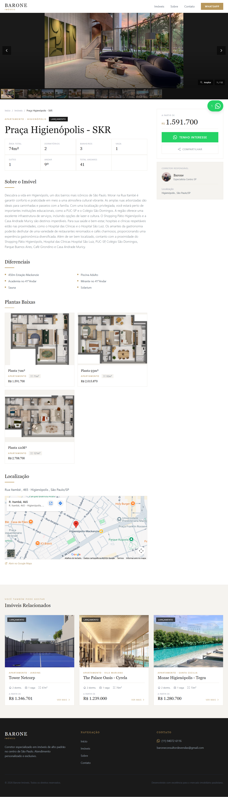
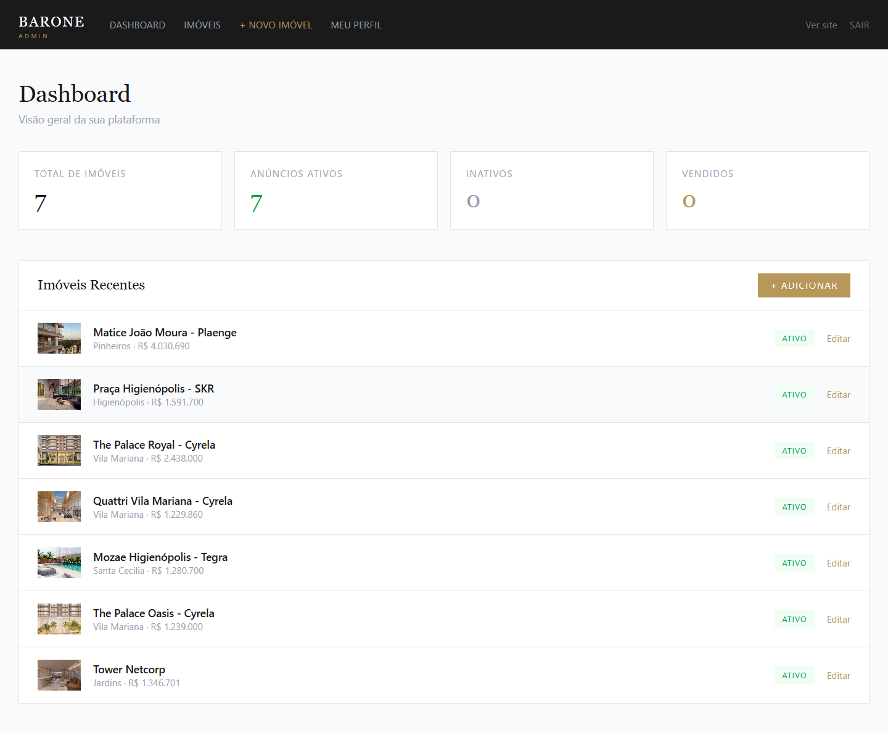
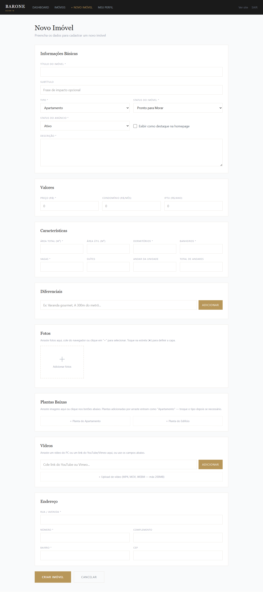
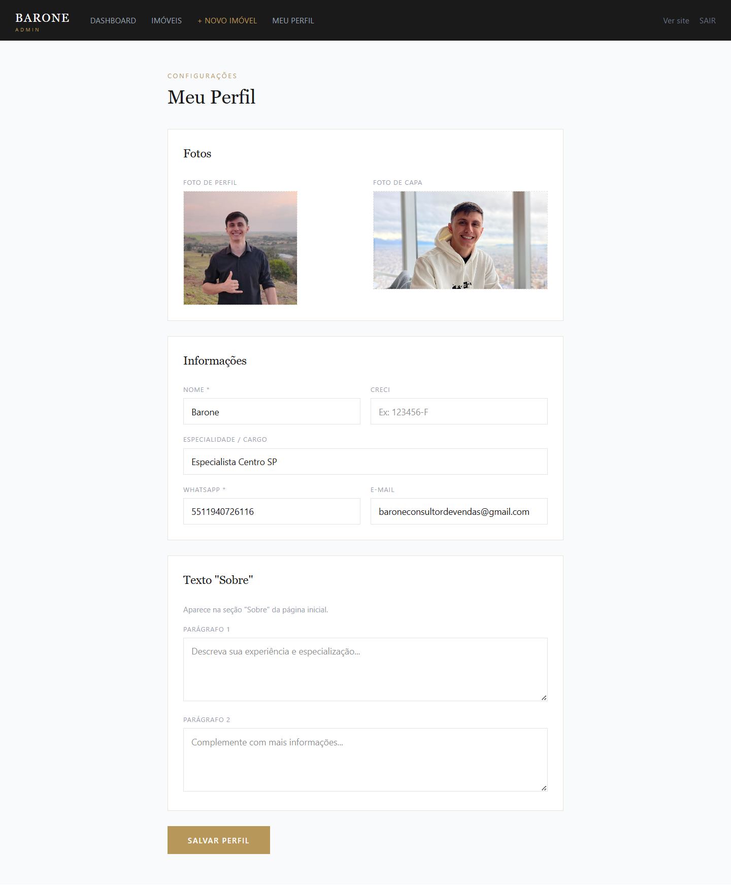

<div align="center">


<br/>
<br/>

<h1>Imoveis Barone</h1>

<p>Plataforma imobiliaria full stack para um corretor de alto padrao no centro de Sao Paulo.<br/>
Site publico com SEO forte, paginas de imovel ricas em conteudo e painel administrativo completo.</p>

<p>
  <a href="https://www.imoveisbarone.com">
    
  </a>
</p>

<p>
  
  
  
  
</p>

</div>

---

## Sobre o projeto

Imoveis Barone e uma plataforma imobiliaria pensada para operacao real: um site institucional e comercial para exibicao de imoveis de alto padrao, combinado com um painel administrativo para cadastrar, editar e publicar anuncios sem depender de CMS externo.

O foco do produto e conversao e autonomia. No lado publico, o visitante acessa a landing page, navega pelos imoveis, entra nas paginas de detalhe com fotos, plantas, videos, mapa e CTA para WhatsApp. No lado administrativo, o corretor gerencia portfolio, perfil profissional e midias da operacao em um painel proprio.

---

## Funcionalidades

**Site publico**
- Landing page com hero editorial, secoes de destaque, grade de imoveis e CTA final para WhatsApp.
- Paginas de imovel com galeria de fotos, ficha tecnica, diferenciais, plantas baixas, videos, mapa incorporado e imoveis relacionados.
- Botao de compartilhamento com suporte a Web Share no mobile, copia de mensagem pronta e copia do link.
- Conteudo dinamico do corretor na homepage, incluindo foto de perfil, foto de capa, bio, especialidade e contato.

**Painel administrativo**
- Login administrativo por senha com sessao em cookie e protecao das rotas `/admin` via `proxy.ts`.
- Dashboard com totais de imoveis, anuncios ativos, inativos e vendidos, alem de listagem rapida dos registros recentes.
- CRUD completo de imoveis com campos de precificacao, ficha tecnica, endereco, status, destaque na homepage e exclusao.
- Upload de fotos, plantas e videos com arrastar e soltar, upload local, importacao por URL e suporte a links de YouTube e Vimeo.
- Edicao do perfil do corretor com fotos, bio, WhatsApp, email, CRECI e texto exibido no site publico.

**SEO e infraestrutura**
- Metadata dinamica por imovel, Open Graph, JSON-LD estruturado e pagina dedicada por slug.
- `sitemap.ts` e `robots.ts` gerados pelo App Router.
- Integracao com Supabase para banco, storage e leitura server-side dos dados publicados.

---

## Tecnologias

| Camada | Tecnologia |
|---|---|
| Framework | Next.js 16 - App Router |
| Linguagem | TypeScript |
| UI | React 19 |
| Estilizacao | Tailwind CSS 4 |
| Banco de dados | PostgreSQL via `pg` |
| Backend as a Service | Supabase |
| Autenticacao admin | Cookie session + `ADMIN_PASSWORD` |
| Storage de midia | Supabase Storage |
| Midia e imagens | Sharp + upload routes |
| Deploy | Vercel |

---

## Screenshots

Abaixo estao as principais telas do produto, capturadas em execucao real.

---

### Landing page

> Pagina inicial com hero premium, CTA para WhatsApp, grade publica de imoveis, secao "Quem somos" com o corretor e CTA final de conversao.



---

### Pagina do imovel

> Tela de detalhe com galeria destacada, breadcrumb, ficha tecnica, preco em destaque, CTA de interesse, botao de compartilhar, plantas baixas, mapa e cards de imoveis relacionados.



---

### Painel administrativo - Dashboard

> Visao geral da operacao com contadores de anuncios, status dos imoveis e acesso rapido aos registros mais recentes para manutencao do portfolio.



---

### Painel administrativo - Novo imovel

> Formulario completo de cadastro com informacoes basicas, valores, caracteristicas, diferenciais, fotos, plantas, videos e endereco. O fluxo aceita upload local e importacao de midias por URL.



---

### Painel administrativo - Meu perfil

> Area de configuracao do corretor responsavel, com fotos, dados profissionais, WhatsApp, email e textos que alimentam a secao "Sobre" da homepage.



---

## Rodando localmente

```bash
git clone https://github.com/Miguel-Pires/imobiliaria.git
cd imobiliaria
npm install
# crie um arquivo .env.local com as variaveis abaixo
npm run dev
```

**Variaveis de ambiente necessarias:**

```env
NEXT_PUBLIC_SUPABASE_URL=
NEXT_PUBLIC_SUPABASE_ANON_KEY=
SUPABASE_SERVICE_ROLE_KEY=

# recomendadas
ADMIN_PASSWORD=
NEXT_PUBLIC_SITE_URL=http://localhost:3000
NEXT_PUBLIC_WHATSAPP=5511999999999
```

`ADMIN_PASSWORD` possui fallback no codigo para desenvolvimento, mas deve ser definido explicitamente em qualquer ambiente real.

---

## Estrutura do projeto

```text
src/
├── app/
│   ├── page.tsx
│   ├── layout.tsx
│   ├── globals.css
│   ├── sitemap.ts
│   ├── robots.ts
│   ├── imoveis/
│   │   └── [slug]/
│   │       ├── page.tsx
│   │       └── opengraph-image.tsx
│   ├── admin/
│   │   ├── login/page.tsx
│   │   ├── page.tsx
│   │   ├── perfil/page.tsx
│   │   └── imoveis/
│   │       ├── page.tsx
│   │       ├── novo/page.tsx
│   │       └── [id]/page.tsx
│   └── api/
│       ├── admin/login/route.ts
│       ├── imoveis/route.ts
│       ├── imoveis/[id]/route.ts
│       ├── perfil/route.ts
│       ├── upload/route.ts
│       └── upload-from-url/route.ts
├── components/
│   ├── Header.tsx
│   ├── Footer.tsx
│   ├── ImovelCard.tsx
│   ├── GaleriaFotos.tsx
│   ├── PlantasBaixas.tsx
│   ├── BotaoCompartilhar.tsx
│   ├── WhatsAppFloat.tsx
│   └── admin/
│       ├── AdminNav.tsx
│       └── ImovelForm.tsx
├── lib/
│   ├── auth.ts
│   ├── db.ts
│   └── supabase.ts
├── types/
│   └── imovel.ts
└── proxy.ts
docs/
└── assets/
    ├── hero.png
    ├── full.png
    └── screenshots/
supabase-schema.sql
```

---

<div align="center">
  <sub>Desenvolvido por <a href="https://github.com/Miguel-Pires">Miguel Pires</a></sub>
</div>
